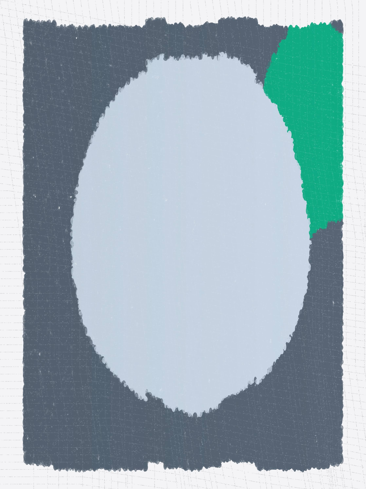
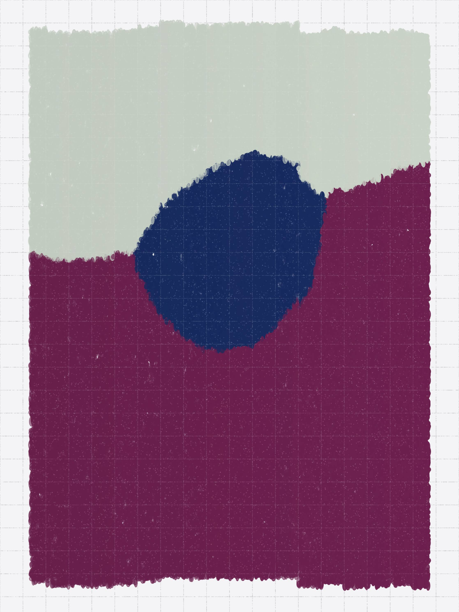
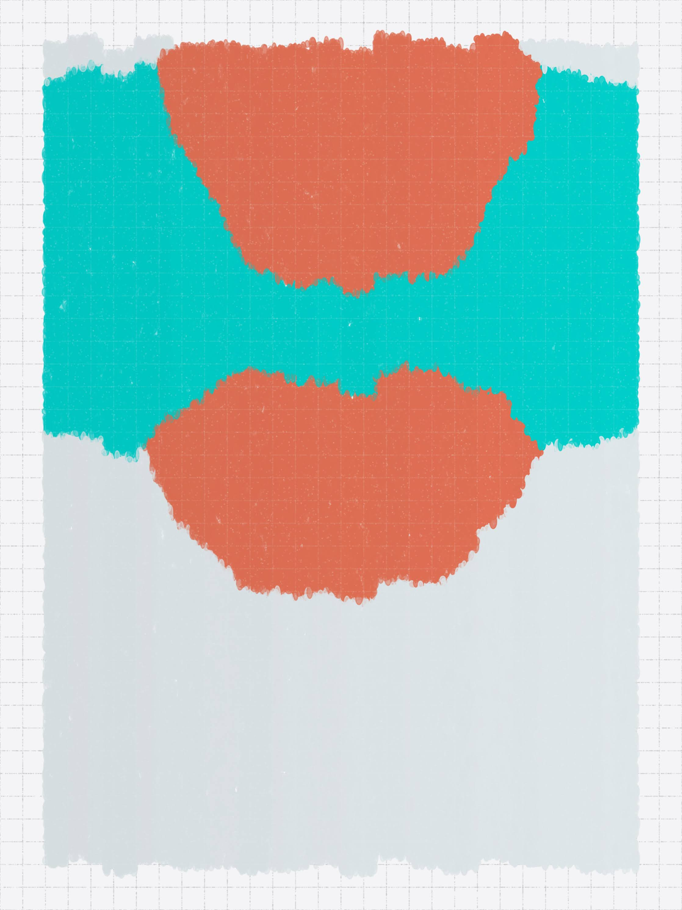

# Aragnation

Aragnation is a long-form AI generative art project by [Devi Parikh][devi] and [Abhishek Das][das] on [ArtBlocks][artblocks].  

## The Concept

Aragnation questions preconceived notions of what AI art can be. Does AI art have to be powered by giant neural networks? Do the aesthetics have to be that of photos or paintings or collages of pieces thereof?

Aragnation uses tiny AI models and constructs abstract imagery in the vocabulary of abstract blobs and organic textures rather than pixels. It is playful with colors. It has a hint of a watercolor and art paper aesthetic. 

The training data includes photographs taken by one of the artists, Abhishek.  The generated pieces thus capture, in broad strokes, [Abhishek’s photography][das-photos] – nature, landscapes and urban settings.

In a refreshing contrast to the gravity of the role AI technology is playing in content creation and creative expression, Aragnation brings a light and joyful touch to generative AI art. 

No GPUs were harmed in the making of Aragnation. All AI models are entirely different architectures than those commonly used, and have been designed and trained from scratch by the artists.

## The Models

Aragnation uses two AI models. One model learns the composition of images, and the other learns the color gradients in images.

The first is a probabilistic graphical model (not a neural network) that explicitly performs probabilistic reasoning to generate an image. It has learned to compose 25 prototype shapes and 17 colors to generate its interpretation of landscapes, flowers, birds, and urban settings. These prototype shapes and colors are also learned from data.

The second is a small neural network (a multilayer perceptron in particular) that has learned to map image (x,y) coordinates to RGB colors, and is used to predict the saturation of colors in some of the pieces. 

Intersting tidbit: Aragnation is an anagram of “No-GAN AI Art", where "GAN" is used to symbolize not just GANs but also transformers and diffusion models – techniques which are commonly used in the recently popularized image generation AI technology.

## The Features

Aragnation has six features.

1. Paper: The background paper is one of four styles -- graph, rods and cones, marble, and fabric
2. Colors: The colors are either sampled using an AI model or randomly for a more playful aesthetic
3. Palette: One of fourteen palettes partially curated by the AI model
4. Subject: An AI model assigns the generated piece to one of four categories -- flower, bird, urban and landscape
5. Texture: The texture of a piece is either plain or has a gradient generated using an AI model
6. Reflection: Some of the pieces have added depth to them via a horizontal reflection 

## The Artists

Devi and Abhishek have collaborated on dozens of projects since 2015. Many in AI, some in art, and some unrelated to either AI or art. Abhishek first introduced Devi to generative art in 2018!

### Devi Parikh

Devi Parikh is an AI researcher and a generative artist. She also makes [Macrame][macrame], [Origami][origami], and maintains a physical sketchbook with kawaii doodles, zentangles, mandalas, paper cutting and sketches. 

While evolving, her generative art so far has tended to have vibrant colors, geometric patterns, symmetries, and crisp textures co-existing with organic shapes. She gets inspiration from a variety of sources -- some mundane, some exotic; some traditional, some unexpected; some specific, some diffused -- colors in rare stones, textures in snake skins, graffiti, wall art, digital illustrations, acrylic pouring, mandalas, ethnic fabrics, looking out the window during a long taxi ride, Indian culture, or feedback from a trusted friend. She maintains an ever growing list of ideas -- ranging from small tweaks to an existing project to entirely new projects or styles. Her process involves starting with an idea, prototyping the core of it to see if it feels right, and then iterating, iterating, iterating. The joy and mystery is in seeing where the iterations lead!

She gets energy out of creative expression. Some of it through her art -- both digital and analog. Some of it through her research in AI. In fact, the two intersect -- part of her work is on developing AI that can enhance human creativity -- give people new tools for creative expression.

She was born in Tulsa, Oklahoma, USA. But you wouldn't guess from her name, how she looks, or how she sounds. She has lived in Riyadh, Saudi Arabia. She grew up in Ahmedabad, India. She currently lives in San Francisco, USA. She has an abysmal sense of space and orientation. She has an excellent sense of time. She hates small talk. She loves deep connections with people. She appeared in Forbes' list of 20 "Incredible Women Advancing A.I. Research". 

She has dabbled in sketching, painting, origami, dancing, music all her life -- she was decent at some of this, not so much at the rest :) She was first introduced to AI in 2003 in junior year of college and has worked in AI since. She was introduced to generative art in 2018, when her day-job presented fewer opportunities to be hands-on with code. Generative art scratched the itch to code as well as explore AI for creativity.

Find out more about Devi's art at [http://stateoftheheart.ai/][soth]. You can also find her on [Twitter][tw], [Instagram][insta], [Foundation][fnd] and [fxhash][fxhash]. 

### Abhishek Das

Abhishek Das is a scientist working on using artificial intelligence for discovering catalysts that can enable large-scale renewable energy storage, as part of the [Open Catalyst Project](https://opencatalystproject.org/).

Abhishek was born and raised in New Delhi, India, and moved to the United States in 2016 for his PhD. He first learnt how to write code back in middle school, and his first project was a graph plotting library written in C++. At the time, the results had felt magical — the program could visualize almost any function! He has been in awe of the power of software ever since.

Abhishek's favorite stress-buster is playing the piano; he is a trained pianist and has been playing since he was 5. In a parallel universe, he'd be teaching music. Some day!

He has admired generative art and artists from the sidelines for years. What he finds fascinating about generative art is that the core ideas and constraints are simple, but there's infinite room for randomness to take over and for complexity to emerge.

Inspired by Devi's enthusiasm, he recently decided to take the plunge into generative art. His art explores algorithms that mimic textures from the physical world — paper, ink, cloth, sand, water — which sometimes come together in unexpected, otherworldly ways to create beautiful outputs. Aragnation has hints of this.

More about Abhishek on [his webpage](https://abhishekdas.com). He is also on [Twitter](https://twitter.com/abhshkdz).

## The Visuals

Below are several Aragnations.

  
  

    
  

  

  
  

    
  

  

  
  

    
  

  

  
  

    
  

  

[artblocks]: https://www.artblocks.io/
[das]: https://abhishekdas.com/art/
[devi]: http://stateoftheheart.ai/
[das-photos]: https://www.instagram.com/abhshkdz/
[aragnation]: https://deviparikh.github.io/aragnation/
[sketchbook]: https://deviparikh.com/sketchbook.html
[macrame]: https://deviparikh.com/yarn.html
[origami]: https://deviparikh.com/origami.html
[soth]: http://stateoftheheart.ai/ 
[devi]: https://deviparikh.com/
[tw]: https://twitter.com/deviparikh
[insta]: https://www.instagram.com/deviparikh/
[fnd]: https://foundation.app/@deviparikh
[fxhash]:  https://www.fxhash.xyz/u/Devi%20Parikh
